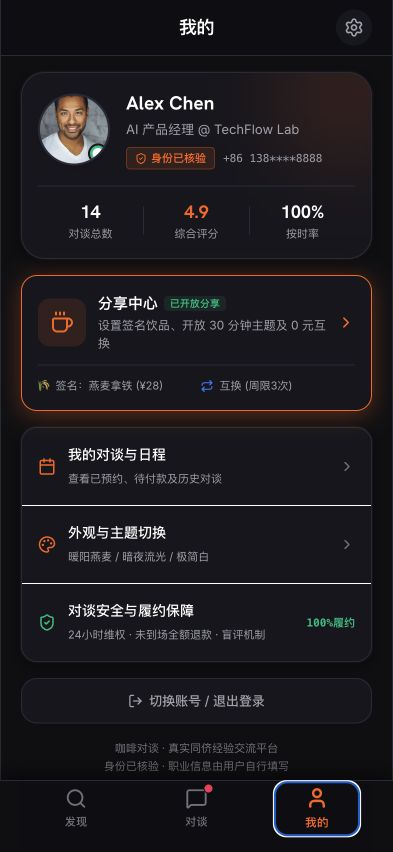
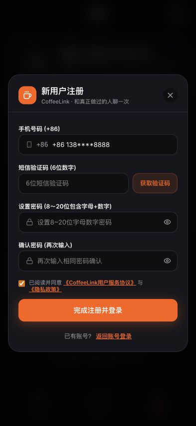
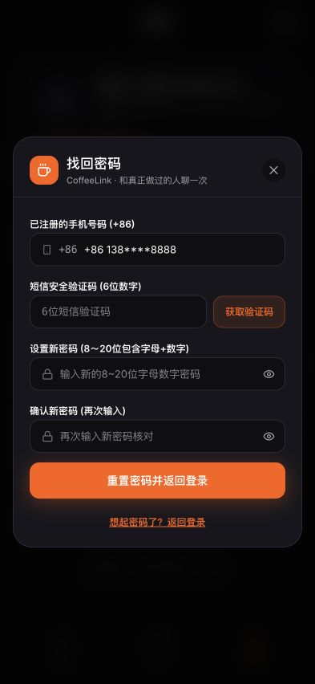

# CoffeeLink iOS 适配体验审计

审计日期：2026-08-14  
审计范围：发现首页 → 分享者详情 → 发起电子咖啡邀请 → 我的 → 登录 → 注册 → 找回密码 → 对谈列表  
测试视口：393 × 852，iPhone 竖屏尺寸  
审计方式：当前运行原型截图、交互检查、关键控件尺寸测量和前端实现检查；未修改产品代码。

## 总体结论

当前原型可以作为 iPhone 尺寸的交互演示，但不能视为已经符合 iOS 系统规范或可直接提交 App Store 的实现。

- 产品结构与移动端任务流基本成立：三栏 Tab、详情返回、固定主操作、登录注册与找回密码均可走通。
- 当前工程是 React + Vite Web 项目，不包含 Xcode 工程、SwiftUI/UIKit 运行目标、`Info.plist` 或原生系统能力接入。
- 最大适配问题是安全区样式只定义未使用，顶部没有状态栏占位，底部固定栏没有使用 Home Indicator 安全区。
- 字体大量固定为 10～13px，不能跟随 Dynamic Type；代码中相关固定小字号出现 211 处。
- 多个关键控件小于 Apple 建议的 44 × 44pt：设置按钮 36 × 36、弹层关闭按钮 29 × 29、验证码按钮 90 × 40、密码显隐按钮图标点击区约 15 × 15。
- 登录注册弹层缺少 `dialog` / `aria-modal` 语义，关闭和密码显隐按钮缺少可访问名称，Tab 缺少选中语义。
- 手机、验证码和密码字段虽使用基础输入类型，但没有配置用户名、当前密码、新密码和一次性验证码的 AutoFill 语义。

## 审计步骤

### 1. 发现首页 — 一般

优点：三栏底部导航清楚；搜索、分类和分享者卡片符合单手浏览路径。  
风险：顶部从屏幕 0 点开始，没有状态栏安全区；正文和标签密度较高，大量 10～13px 文本不利于 Dynamic Type；底部栏贴住屏幕底边。

### 2. 分享者详情 — 一般

优点：返回、标题和双主路径清晰，电子咖啡与主题互换区分明确。  
风险：底部双按钮没有 Home Indicator 安全间距；页面顶部返回与更多按钮的有效点击区小于 44pt；顶部和底部均为 Web 固定栏，而非原生导航栏、工具栏或安全区布局。

### 3. 发起邀请 — 一般偏弱

优点：主题、问题、时段和接受后付款的步骤顺序明确。  
风险：单屏信息过密，固定底部付款栏会压缩表单可视区；使用键盘填写长问题时仍需在真机验证键盘避让、焦点滚动和提交按钮可见性。

### 4. 我的 — 一般

优点：账号、分享中心和履约信息分组明确。  
风险：点击 Tab 后出现 Web 焦点描边；主题切换由应用自定义管理，未跟随 iOS 系统外观；默认深色也与 PRD 的“首版只做浅色”不一致。

### 5. 密码登录 — 一般偏弱

优点：手机号、密码、找回密码和注册入口齐全，密码使用安全输入类型。  
风险：居中浮层更像桌面 Web Dialog，不像 iPhone Sheet 或全屏登录；关闭按钮只有 29 × 29；表单缺少 AutoFill 语义和可访问 Dialog 语义；演示账号不应出现在正式版本。

### 6. 新用户注册 — 较弱

优点：注册字段与 PRD 基本覆盖，协议入口可见。  
风险：五项输入集中在居中弹层中，软键盘出现后容易遮挡或迫使内部滚动；验证码输入未声明数字键盘与一次性验证码 AutoFill；密码显隐按钮的点击区和可访问名称不足；按钮文案“完成注册并登录”与 PRD“注册后返回登录页”冲突。

### 7. 找回密码 — 较弱

优点：手机号验证、新密码和二次确认完整。  
风险：与注册页相同的键盘避让、AutoFill、点击区和可访问语义问题；错误和成功状态没有可确认的 `aria-live` / 系统公告机制。

### 8. 对谈列表 — 一般偏弱

优点：我发起/发给我、状态筛选和强状态操作都可见。  
风险：卡片内容与筛选项过密，问题正文在小区域内被截断；动态字体放大后极易重叠；底部 Tab 焦点描边和安全区问题再次出现。

## 优先级建议

### P0：进入原生开发前必须处理

1. 明确交付形态：若目标是 App Store iOS App，应以 SwiftUI/UIKit 或明确的原生容器工程落地，当前 Vite 项目只能作为原型。
2. 将顶部、底部导航和所有固定操作栏接入真实 Safe Area，保留系统状态栏与 Home Indicator 空间。
3. 把登录、注册和找回密码改为 iOS Sheet 或全屏表单，并验证软键盘、焦点滚动和错误定位。
4. 使用系统文本样式和 Dynamic Type，删除关键正文中的固定 10px 文本，验证至少 200% 放大。
5. 所有可点击控件提供至少 44 × 44pt 点击区；为关闭、密码显隐和 Tab 选中状态补齐 VoiceOver 语义。
6. 接入手机号、密码、新密码与 OTP 的系统 AutoFill / Keychain 语义。

### P1：体验接近 iOS 后处理

1. 用系统 Tab Bar、Navigation Stack、Sheet、Alert、Date/Time Picker 和 SF Symbols 替换高频自绘结构。
2. 减少卡片边框、发光阴影和缩放动画；保留 CoffeeLink 橙色作为品牌强调，不让每个层级同时竞争注意力。
3. 合并列表中的次要信息，让首页和对谈页优先呈现人、主题、时间和当前动作。
4. 明确首版只支持浅色，或正式支持系统深浅色自动切换，避免自定义主题与系统外观冲突。

## 证据限制

- 截图和 DOM 可以确认布局、结构与部分语义风险，但不能证明 VoiceOver、Voice Control、Dynamic Type、Reduce Motion、键盘避让或真机 Safe Area 已通过。
- 未在 Xcode Simulator 或实体 iPhone 上运行，因为当前目录不是原生 iOS 工程。
- 未验证 App Store 审核、推送、短信、支付、Keychain、Face ID、网络权限和系统会议跳转。

## 参考

- Apple Human Interface Guidelines — Layout: https://developer.apple.com/design/human-interface-guidelines/layout
- Apple Human Interface Guidelines — Tab bars: https://developer.apple.com/design/human-interface-guidelines/tab-bars
- Apple Human Interface Guidelines — Typography: https://developer.apple.com/design/human-interface-guidelines/typography
- Apple Human Interface Guidelines — Modality: https://developer.apple.com/design/human-interface-guidelines/modality
- Apple Human Interface Guidelines — Text fields: https://developer.apple.com/design/human-interface-guidelines/text-fields
- Apple UI Design Dos and Don’ts: https://developer.apple.com/design/tips/
- Apple Password AutoFill: https://developer.apple.com/documentation/security/enabling-password-autofill-on-a-text-input-view
